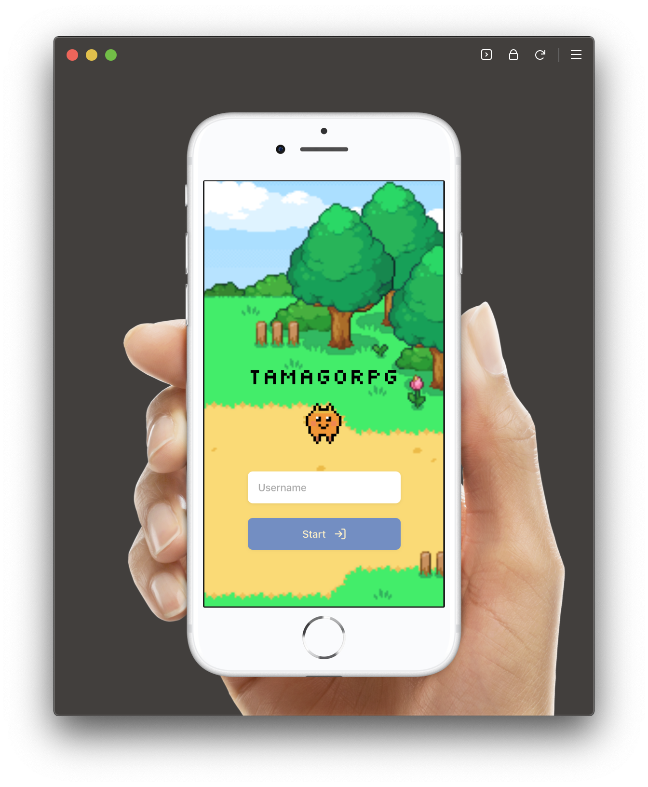

# Tamago RPG

Framer X prototype of Role Playing Game, Real-time Multiplayer Chatting game. This project is a proof of concept of making a game with Framer X

Assets (cat sprite animation) are taken from https://github.com/graceavery/tamagotchiTemp

Demo:

# Packages

This prototypes also use some of this packages

- ### [JotStick](https://packages.framer.com/package/codemilli/joystick)

- ### [Framer Base](https://packages.framer.com/package/framer/base)

# Chat Server

- ### [Figma Chat Server](https://github.com/ph1p/figma-chat-server)
